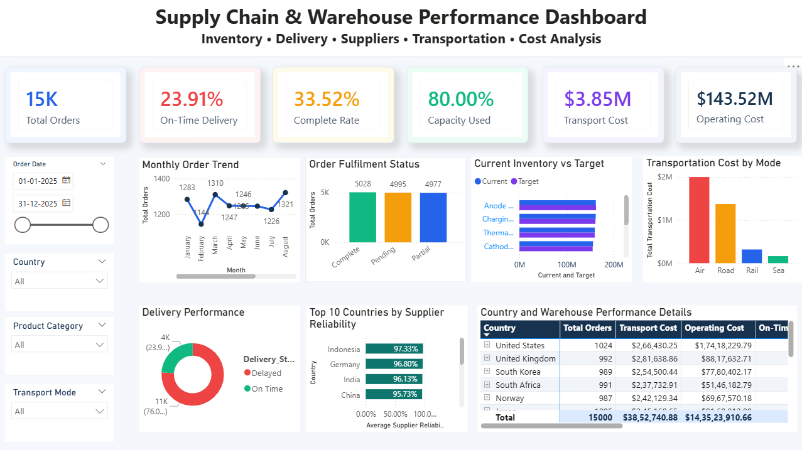

# EV-Supply-Chain-PowerBI-Dashboard
Interactive Power BI dashboard for supply chain, inventory, delivery, supplier, transportation and warehouse cost analysis.
# EV Supply Chain and Warehouse Performance Dashboard

## Project Overview

This project presents an interactive Power BI dashboard for analyzing EV supply-chain and warehouse performance. It combines inventory, orders, deliveries, suppliers, transportation and cost information on a single dashboard.

## Dashboard Preview

## Key Performance Indicators

- Total Orders: 15,000
- On-Time Delivery Rate: 23.91%
- Complete Order Rate: 33.52%
- Warehouse Capacity Utilization: 80%
- Transportation Cost: $3.85M
- Warehouse Operating Cost: $143.52M

## Dashboard Features

- Monthly order trend analysis
- Complete, pending and partial order comparison
- Current inventory versus target inventory
- Transportation cost by mode
- Delayed versus on-time delivery analysis
- Supplier reliability by country
- Country and warehouse-level performance matrix
- Interactive filters for date, country, product category and transport mode

## Tools Used

- Microsoft Power BI
- Power Query
- DAX
- Microsoft Excel
- Data visualization and analysis

## Data Preparation

The Excel dataset was imported into Power BI and cleaned using Power Query. Data types were corrected for dates, numerical values, percentages and text fields.

Calculated columns were created for order month, delivery delay and inventory gap. DAX measures were created for orders, delivery rates, fulfilment rates, capacity utilization and costs.

## Key Insights

- Only 23.91% of shipments were delivered on time.
- Approximately 76.09% of shipments were delayed.
- Only 33.52% of orders were completely fulfilled.
- Warehouse capacity utilization reached approximately 80%.
- Air transportation generated the highest transportation cost.
- Supplier reliability was high, but delivery performance remained low.

## Files

- `Supply_Chain_Warehouse_Dashboard.pbix` — Power BI report
- `Milestone4_Updated_Sheet.xlsx` — Source dataset
- `dashboard-preview.png` — Dashboard screenshot

## Author

**Pabbiti Vamsi**  
B.Tech Computer Science and Engineering — Data Science  
Graduation Year: 2027
